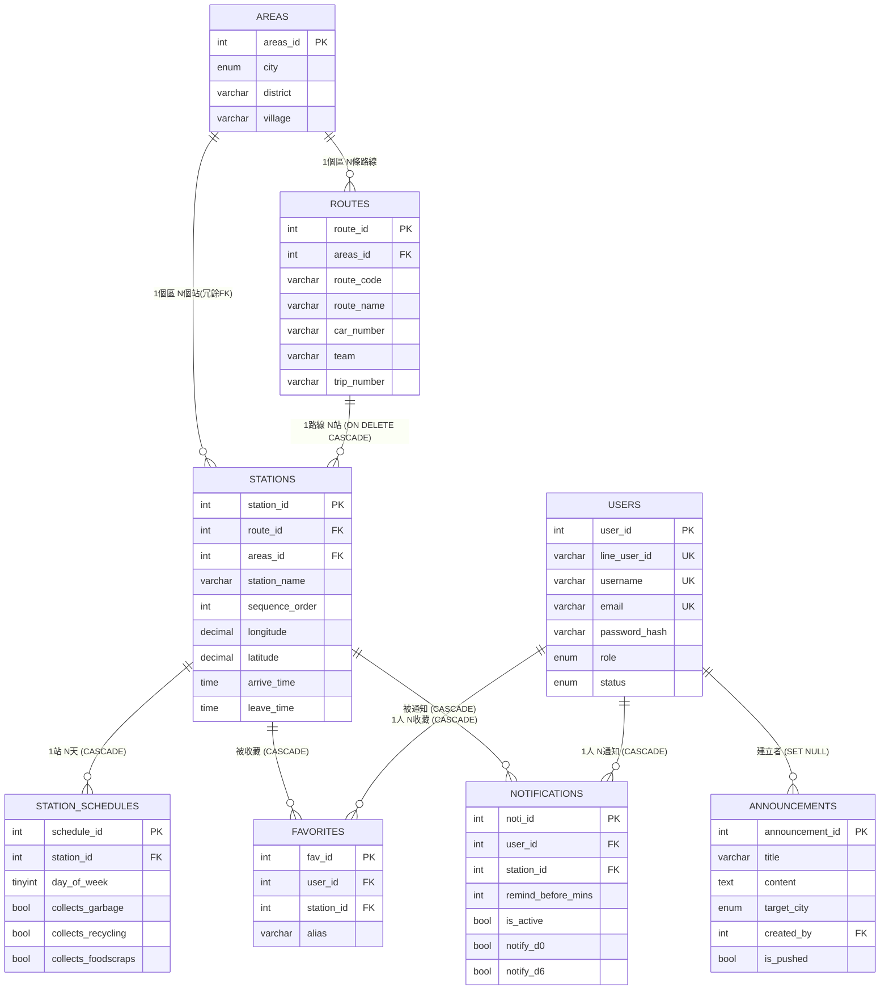
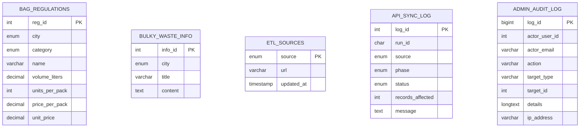

# 北北基垃圾車追蹤平台 — 系統開發報告

> 文件版本：v1.0（2026-06-08）
> 對應程式碼版本：ARCHITECTURE.md v3.1
> 開發團隊：5 人小組（後端、前端、LIFF、ETL、設計／QA 分工）

---

## 目錄

1. [系統開發動機與目的](#一系統開發動機與目的)
2. [系統功能介紹與展示](#二系統功能介紹與展示)
   - 2.1 [一般使用者端（LINE Bot ＋ LIFF）](#21-一般使用者端line-bot--liff)
   - 2.2 [管理者端（React 後台）](#22-管理者端react-後台)
3. [資料來源](#三資料來源)
4. [資料表內容介紹](#四資料表內容介紹)
5. [ERD（實體關聯圖）](#五erd實體關聯圖)
6. [系統軟硬體與運用的 API 版本描述](#六系統軟硬體與運用的-api-版本描述)

---

## 一、系統開發動機與目的

### 1.1 動機

雙北與基隆三市環保局雖各自釋出垃圾車清運的開放資料，但格式、欄位、發布方式皆不相同：

- **台北市**：data.taipei，CSV，含經緯度、抵達／駛離時間、收運項目欄位。
- **新北市**：data.ntpc.gov.tw，CSV，欄位命名與台北市不同，部份站點缺座標。
- **基隆市**：opendata-kl.askeycloud.com，CSV，由市府委外平台提供，欄位最稀疏。

民眾若要查「我家附近的垃圾車什麼時候到」，得分別到三市網站、用不同篩選介面查詢，且各市開放資料平台**幾乎沒有提供地圖視覺化、收藏與到站通知**，更沒有人會主動每天去查靜態 CSV。對通勤族、雙城工作者、剛搬家者尤其不便。

### 1.2 目的

本系統的核心目的為「**把三市分散的清運資訊整合成一致的查詢、收藏與通知體驗**」，並針對兩種角色提供不同入口：

| 角色 | 入口 | 核心訴求 |
|---|---|---|
| 一般民眾 | LINE Bot（加好友即用） | 零安裝、零註冊、地圖直觀、會主動通知 |
| 管理者（環保局／系統維運） | React 後台（網頁登入） | 看到資料庫狀態、能改公告／規範、能觸發 ETL、能追蹤誰改了什麼 |

### 1.3 與既有方案的差異

| 維度 | 既有開放資料平台 | 本系統 |
|---|---|---|
| 涵蓋範圍 | 單一城市 | 三市整合 |
| 介面 | 表格／CSV 下載 | 地圖（Leaflet + OSM）＋ 卡片化站點面板 |
| 註冊 | 不需要也不能 | 不需要（用 LINE 身分） |
| 收藏 | 無 | 有，跨裝置同步（綁 line_user_id） |
| 主動通知 | 無 | 有，可設提前 1–60 分鐘、可逐日開關 |
| 資料新鮮度 | 開放平台原始發布頻率 | 每日 02:00 自動 ETL，可後台手動觸發 |
| 管理者追溯 | 無 | `admin_audit_log` 全量審計（升降權、ETL、公告推播…） |

---

## 二、系統功能介紹與展示

> 本系統採「**雙產品線設計**」：一般使用者走 LINE / LIFF（深色＋ LINE 綠），管理者走 React 後台（亮色＋ indigo，可一鍵切暗）。配色刻意區隔，避免使用者誤入管理介面。

### 2.1 一般使用者端（LINE Bot ＋ LIFF）

#### 2.1.1 取得方式
- 用 LINE 掃 QR Code 加官方帳號為好友
- 加好友當下：後端的 `FollowEvent` 自動抓暱稱、寫入 `users` 表（以 `line_user_id` 為主鍵綁定），回送歡迎訊息
- 無需註冊、無需密碼

#### 2.1.2 圖文選單與關鍵字導頁
輸入特定關鍵字會回傳對應 LIFF 連結（`https://liff.line.me/{LIFF_ID}/<page>`）：

| 關鍵字 | 對應 LIFF 頁 | 功能 |
|---|---|---|
| `地圖` | `/map` | 地圖式查詢附近垃圾車站點 |
| `查詢` | `/search` | 文字搜尋站名 |
| `最愛` / `收藏` | `/me` | 收藏站列表＋通知管理（整併頁） |
| `通知` / `提醒` | `/me` | 同上 |
| `綁定` | `/credentials` | 綁定 email（為未來升管理員預留） |

#### 2.1.3 各 LIFF 頁面介紹

##### A. 地圖頁 `/map`（核心功能）

**介面元素**：
- 全螢幕 Leaflet 地圖（OSM 圖磚）
- 頂部：搜尋半徑下拉（50 / 100 / 200 / 500 公尺）
- 右下角浮動按鈕：拖曳搜尋圖釘、定位
- 點選站點 Marker → 底部彈出站點面板（卡片化）：
  - 站點名稱
  - 一週收運時間表（橫向 7 格，當日高亮，顯示收運種類）
  - 該地點所有班次的到達時間（mono 字體）
  - 三顆按鈕：**加入收藏 / 顯示路線 / 關閉**（已收藏者按鈕變紅「移除收藏」）

**使用流程**：
1. 開地圖頁，自動定位（或手動拖曳搜尋圖釘）
2. 調整半徑 → 自動撈該範圍內站點，顯示 Marker
3. 點 Marker → 看詳細收運表與時間
4. 按「加入收藏」→ 自動同時開啟到站通知（預設依該站收運日，提前 5 分鐘推播）

**狀態保留**：使用者離開地圖到搜尋頁，再按「回到地圖」會回到離開時的位置、縮放、半徑（用 sessionStorage 暫存）。

##### B. 搜尋頁 `/search`
- 文字輸入站名 → 即時搜尋全國站點
- 結果以卡片列出：站名、所屬路線、城市區域、到達時間
- 同一站名不同班次**不摺疊**，使用者可看到一站多時段
- 點任一卡片 → 跳到地圖頁聚焦該站

##### C. 收藏＋通知整併頁 `/me`
- 列出本人所有收藏站
- 每站顯示：站名、別名（可改）、該站每週收運星期一覽
- 通知開關（總開關 + 提前分鐘 + 逐日 7 個 checkbox）
- 預設行為：加入收藏即自動開啟通知，依該站實際收運日勾選

##### D. 垃圾袋規範頁 `/bag`
- 選台北市 / 新北市
- 表格列出該市所有專用袋規格（容量、單價、每包售價、購買地點）
- 含環保兩用袋（新北市）

##### E. 大型廢棄物清運頁 `/bulky`
- 三市分頁顯示市府公告的大型廢棄物清運申請方式、聯絡電話、規費

##### F. 入口頁 `/index`、綁定信箱頁 `/credentials`
- `index`：載入 LIFF SDK、`liff.init()` 完成後依 `liff.state` deep link 轉跳子頁
- `credentials`：讓使用者設定 email + 密碼（為日後晉升管理員時的登入帳號預留）

#### 2.1.4 到站推播
- 由後端 APScheduler **每 60 秒**檢查一次：今天有收運、現在落在使用者設定的提醒窗內、且通知開關開著的，就透過 LINE Push API 主動推訊息
- 記憶體去重，避免 60 秒內重複推同一筆

---

### 2.2 管理者端（React 後台）

#### 2.2.1 登入
- URL：`http://<部署網域>/`
- 帳號：必須是 `users` 表中 `role = admin`、且 `status = active` 的 email
- 流程：`POST /api/auth/admin/login` → 驗密碼通過後簽發 **itsdangerous Bearer token**（有效 7 天）
- 前端把 token 存在 `localStorage.access_token`，每次 API 呼叫由 `authedFetch` wrapper 自動帶 `Authorization: Bearer <token>`
- 收到 401 → 自動 `localStorage.clear()` 並重導回 Login

#### 2.2.2 後台側欄結構

```
🗑️ Trash Tracker
├─ 📁 顯示資料表（可展開）
│   └─ admin_audit_log / announcements / api_sync_log / areas
│      bag_regulations / bulky_waste_info / etl_sources
│      favorites / notifications / routes / stations
│      station_schedules / users
├─ 👥 管理使用者
├─ 🚧 新增與刪除面板
├─ 📢 規則與公告
├─ 🔗 ETL 來源設定
├─ 🔄 API 同步紀錄
└─ 🛡️ 操作紀錄
```

底部顯示「MySQL 已連線 / 斷線中」即時燈號（每 3 秒輪詢 `/api/db-status`）。

#### 2.2.3 各頁功能

##### A. 首頁總覽 `HomeOverview`
- 顯示資料庫連線狀態與三市目前資料筆數（路線數、站點數、班表數）
- 一鍵跳轉到常用頁面

##### B. 顯示資料表 `TableTemplate`
- 從白名單的 13 張表中選一張，以 phpMyAdmin 風格表格瀏覽
- 支援分頁、欄位排序、欄位內全文搜尋
- PK / FK 欄位用色塊標示
- `users.password_hash` 一律遮成 `***`，避免管理者看到雜湊
- 走 `/api/db/browse`、`/api/db/structure`，所有欄位／排序方向皆在後端比對白名單，防 SQL injection

##### C. 管理使用者 `UsersManage`
- 列出全部使用者
- 對單一 user 可執行：
  - **升級為 admin**（需先綁定 email + 密碼，後端驗證）
  - **降級回 user**
  - **停權 / 解除停權**
- 角色 badge 用色：admin = indigo / developer = purple / user = blue
- 每個動作都會寫入 `admin_audit_log`（誰、何時、對誰、改了什麼）

##### D. 新增與刪除面板 `ActionAddDelete`
- 三個子分頁：路線管理 / 站點管理 / 操作歷史
- **路線管理**：
  - 新增清運路線（必填縣市、區、route_name、route_code）
  - 列出現有路線（可篩縣市／區／關鍵字，多欄位 OR 搜尋）
  - 連鎖刪除（會自動清掉該路線下的所有站點與班表，避免 FK 報錯）
- **站點管理**：
  - 為路線新增站點（含 sequence_order、座標、抵達 / 駛離時間）
  - 系統驗證：序位連續、抵達需晚於前站駛離、駛離需早於後站抵達

##### E. 規則與公告 `RulesAnnouncements`
- 三個子分頁：公告 / 大型廢棄物規則 / 垃圾袋規範
- **公告**：建立 / 修改 / 透過 LINE 群發給所有使用者（multicast 自動 500 筆分批）
- **大型廢棄物規則**：依城市維護純文字 / JSON 內容
- **垃圾袋規範**：依城市維護袋型、容量、單價（即一般使用者 `/bag` 頁看到的內容）

##### F. ETL 來源設定 `EtlSources`
- 列出三市 CSV 下載網址與最後更新時間
- 修改網址會**先下載驗證必要欄位**才寫進 `etl_sources`（避免存進壞網址）
- 「立即執行 ETL」按鈕 → 背景觸發一次完整下載 + 匯入

##### G. API 同步紀錄 `SyncLog`
- 列出歷次 ETL 執行（依 `run_id` 群組）
- 每筆顯示：來源（TPE / NTPC / KLU）、階段（download / import）、結果（success / failed / partial）、影響筆數、錯誤訊息
- 用色：success = 綠、partial = 黃、failed = 紅

##### H. 操作紀錄 `AuditLog`
- 列出所有管理者敏感操作（append-only，**不可修改**）
- 已埋點 9 種動作：升降權 / 停權 / 公告 CRUD + 推播 / ETL 來源更新 / ETL 執行 / 路線刪除 / 站點刪除
- 支援動作篩選 + 分頁
- 每筆顯示：時間、操作者 email、動作、對象、details JSON（前後值）、來源 IP、log_id

##### I. 亮 / 暗主題切換
- 後台右上角一鍵切換（☀️ / 🌙）
- 採 CSS 變數實作，全站即時換色，存 localStorage 跨重整保留

---

## 三、資料來源

| 資料類別 | 取得方式 | 來源 | 更新方式 |
|---|---|---|---|
| **路線、站點、班表（三市）** | 開放資料 + 排程爬蟲 | data.taipei、data.ntpc.gov.tw、opendata-kl.askeycloud.com | 每日 02:00 自動 ETL，亦可後台手動觸發 |
| **縣市／行政區／村里** | 自填（隨 schema 種子建立） | 內政部行政區劃，整理進 `areas` 表 | 偶發手動維護 |
| **垃圾袋規範** | 自填（種子資料 + 後台維護） | 台北市 / 新北市環保局 2025 年公告 | 後台 `BagRegulationsEditor` 隨時修改 |
| **大型廢棄物資訊** | 自填 | 三市環保局網站整理 | 後台 `RulesAnnouncements` 隨時修改 |
| **公告** | 自填 | 系統內建立 | 後台建立後可手動 LINE 群發 |
| **使用者** | 自動生成 | LINE FollowEvent 自動建立 | 加好友當下 |
| **使用者收藏 / 通知** | 使用者自填 | LIFF 頁面操作 | 即時 |
| **操作紀錄 / 同步紀錄** | 系統自動產生 | 後端 helper 寫入 | 即時 |

### 3.1 三市 ETL 來源詳述

| 縣市 | 來源平台 | 預設 URL（存於 `etl_sources` 表，可後台修改） | 編碼 |
|---|---|---|---|
| 台北市 TPE | data.taipei | `https://data.taipei/api/dataset/6bb3304b-4f46-4bb0-8cd1-60c66dcd1cae/resource/a6e90031-7ec4-4089-afb5-361a4efe7202/download` | UTF-8 |
| 新北市 NTPC | data.ntpc.gov.tw | `https://data.ntpc.gov.tw/api/datasets/edc3ad26-8ae7-4916-a00b-bc6048d19bf8/csv/file` | UTF-8（轉碼） |
| 基隆市 KLU | opendata-kl.askeycloud.com | `https://opendata-kl.askeycloud.com/route_klepb.csv` | UTF-8 |

### 3.2 ETL 設計重點

- **下載驗證**：`refresh_sources()` 逐市下載，**欄位驗證通過才覆蓋本地 CSV**（任一市失敗不影響其他市）。
- **冪等性**：在 Python 端用「業務 key」做 SELECT-then-INSERT，重跑 ETL 不會重複塞資料、不會改變 `station_id`（保證使用者收藏不失效）。詳見 ARCHITECTURE.md 第 8.0 章。
  - `routes` 業務 key：`areas_id + route_code + route_name + car_number + team + trip_number`
  - `stations` 業務 key：`route_id + station_name`
- **完整紀錄**：一次排程通常產生 6 筆 `api_sync_log`（3 城 × download/import 兩階段），便於定位失敗階段。

---

## 四、資料表內容介紹

共 **14 張表**（utf8mb4 編碼，InnoDB 引擎，所有主鍵 AUTO_INCREMENT 除 `etl_sources` 用 enum、`admin_audit_log` 用 bigint）。

### 4.1 核心業務表（清運資料）

#### 1. `areas` — 行政區字典
| 欄位 | 型別 | 說明 |
|---|---|---|
| areas_id | INT PK | 自增主鍵 |
| city | ENUM('台北市','新北市','基隆市') | 縣市 |
| district | VARCHAR(20) | 行政區 |
| village | VARCHAR(50) | 村里（可 NULL）|

`UNIQUE (city, district, village)` 確保不重複。

#### 2. `routes` — 清運路線
| 欄位 | 型別 | 說明 |
|---|---|---|
| route_id | INT PK | |
| areas_id | INT FK→areas | 所屬區 |
| route_code | VARCHAR(50) | 路線代碼（來源系統的編號）|
| route_name | VARCHAR(100) | 路線名稱（顯示用）|
| car_number | VARCHAR(20) | 車牌 |
| team | VARCHAR(50) | 所屬車隊 |
| trip_number | VARCHAR(20) | 車次／班次 |

#### 3. `stations` — 站點
| 欄位 | 型別 | 說明 |
|---|---|---|
| station_id | INT PK | |
| route_id | INT FK→routes ON DELETE CASCADE | 所屬路線 |
| areas_id | INT FK→areas | 所屬區（冗餘但便於索引）|
| station_name | VARCHAR(200) | 站點名稱 |
| sequence_order | INT | 同路線內的排序 |
| longitude | DECIMAL(10,7) | 經度 |
| latitude | DECIMAL(10,7) | 緯度 |
| arrive_time | TIME | 抵達時間 |
| leave_time | TIME | 駛離時間 |
| stay_type | VARCHAR(20) | 停留型態 |
| memo | TEXT | 備註 |
| raw_source_id | VARCHAR(50) | 來源系統的原始 ID（追溯用）|

索引：`(latitude, longitude)` 給附近站點查詢；`arrive_time` 給下班時段查詢。

#### 4. `station_schedules` — 站點逐日收運班表
| 欄位 | 型別 | 說明 |
|---|---|---|
| schedule_id | INT PK | |
| station_id | INT FK→stations ON DELETE CASCADE | |
| day_of_week | TINYINT | 0=日、1=一 …… 6=六 |
| collects_garbage | TINYINT(1) | 收一般垃圾 |
| collects_recycling | TINYINT(1) | 收資源回收 |
| collects_foodscraps | TINYINT(1) | 收廚餘 |

`UNIQUE (station_id, day_of_week)`：每站每天只能有一筆。

### 4.2 使用者相關

#### 5. `users`
| 欄位 | 型別 | 說明 |
|---|---|---|
| user_id | INT PK | |
| line_user_id | VARCHAR(50) UNIQUE | LINE 身分 |
| username | VARCHAR(50) UNIQUE | LINE 暱稱 |
| email | VARCHAR(100) UNIQUE | 管理員登入帳號 |
| password_hash | VARCHAR(255) | Werkzeug `generate_password_hash` 輸出 |
| role | ENUM('user','developer','admin') DEFAULT 'user' | 角色 |
| status | ENUM('active','suspended') DEFAULT 'active' | 狀態 |
| created_at / updated_at | TIMESTAMP | |

#### 6. `favorites` — 收藏
| 欄位 | 型別 | 說明 |
|---|---|---|
| fav_id | INT PK | |
| user_id | INT FK→users ON DELETE CASCADE | |
| station_id | INT FK→stations ON DELETE CASCADE | |
| alias | VARCHAR(100) | 使用者自訂別名 |
| created_at | TIMESTAMP | |

`UNIQUE (user_id, station_id)`。

#### 7. `notifications` — 到站通知設定
| 欄位 | 型別 | 說明 |
|---|---|---|
| noti_id | INT PK | |
| user_id, station_id | FK | 同上 |
| remind_before_mins | INT DEFAULT 10 | 提前提醒分鐘（API 限 1–60）|
| is_active | TINYINT(1) DEFAULT 1 | 總開關 |
| push_method | ENUM('web','line','email') DEFAULT 'web' | 推播管道（目前用 line）|
| notify_d0 – notify_d6 | TINYINT(1) DEFAULT 1 | 逐星期開關（0=日…6=六）|
| created_at | TIMESTAMP | |

### 4.3 內容類（公告、規範）

#### 8. `announcements` — 公告
target_city 可為 NULL（= 全體）。`is_pushed` 標記是否已 LINE 群發、`pushed_at` 記錄推送時間。`created_by` FK→users ON DELETE SET NULL。

#### 9. `bag_regulations` — 垃圾袋規範
台北市 / 新北市（基隆市無專用袋故不含）。欄位：category（一般專用／環保兩用）、name、volume_liters、units_per_pack、price_per_pack、unit_price、style、purchase_locations、notes。

#### 10. `bulky_waste_info` — 大型廢棄物資訊
依城市維護純文字／JSON 內容。

### 4.4 系統管理類

#### 11. `etl_sources` — ETL 來源網址
`source` enum('TPE','NTPC','KLU') PK；`url`、`updated_at`、`updated_by`。三市固定，僅 url 可後台改。

#### 12. `api_sync_log` — ETL 同步紀錄
`run_id`（UUID）關聯同一次排程；`source`、`phase`、`status`、`records_affected`、`message`、`started_at`、`finished_at`。

#### 13. `admin_audit_log` — 管理者操作審計（append-only）
`actor_user_id` / `actor_email`（操作者，email 冗餘保存避免日後改 email 找不到）、`action`、`target_type` / `target_id`、`details` JSON、`ip_address`、`created_at`。**不設 FK**，與業務表解耦。

### 4.5 索引總覽（主要 KEY）

| 表 | 索引 | 用途 |
|---|---|---|
| areas | `uk_city_district_village` | 防重 |
| stations | `idx_coords (lat, lng)` | 附近站點查詢（Bounding Box） |
| stations | `idx_arrive_time` | 下班時段查詢 |
| station_schedules | `uk_station_day` | 每站每天一筆 |
| favorites | `uk_user_station` | 不可重複收藏 |
| notifications | `idx_active (is_active, station_id)` | notifier 排程主查詢路徑 |
| users | `uk_line_user_id`、`email`、`username` UNIQUE | 三個身分入口 |
| api_sync_log | `idx_run_source_phase` | 同 run 內快速組合查詢 |
| admin_audit_log | `idx_action`、`idx_target`、`idx_created` | 多軸篩選 |

---

## 五、ERD（實體關聯圖）

下方使用 Mermaid `erDiagram` 語法繪製，GitHub / VS Code Markdown Preview 可直接渲染。



### 5.1 獨立表（不在主 ERD 內）

下列表為**輔助型／日誌型**，無 FK 與業務表關聯（刻意解耦）：



### 5.2 關聯設計重點

- **`stations` 同時 FK 到 `routes` 與 `areas`**：areas_id 是冗餘設計，但避免每次查站點都得 JOIN routes 才能拿到城市資訊，索引效率更好。
- **CASCADE vs SET NULL 的選擇**：
  - 刪使用者 → 收藏 / 通知一起清掉（CASCADE，避免孤立資料）
  - 刪使用者 → 公告的 `created_by` 設 NULL（SET NULL，公告本身要保留）
  - 刪路線 → 站點、班表一起清（CASCADE，連帶失效）
- **`admin_audit_log` 不設 FK**：避免「刪掉違規 admin → 連動把該 admin 的操作 log 全刪掉」的隱性矛盾。

---

## 六、系統軟硬體與運用的 API 版本描述

### 6.1 硬體與部署環境

| 項目 | 規格 |
|---|---|
| 部署平台 | **Oracle Cloud Infrastructure (OCI) — 永久免費方案** |
| 機型 | Ampere A1（Arm 64，多核 + 24GB RAM 免費額度內）|
| 作業系統 | Ubuntu Server 22.04 LTS |
| 容器化 | Docker Engine 24+ ／ Docker Compose v2 |
| 反向代理 | Nginx（容器內，frontend service 直接 expose 80）|
| 對外網路 | OCI Security List 開放 22 / 80 / 443 / 8000 |
| 對外網域 | （依專案部署設定）|
| 開發環境 | Windows 10 Pro / WSL2、macOS、本機 Docker |

**為何選 OCI**：5 人小組 demo 階段、零成本壓力、Ampere A1 規格在免費方案中算強（Arm64 對 Python / Node 都已成熟）。

### 6.2 後端軟體棧（Python 3.12）

完整版本見 `backend/requirements.txt`，以下為核心：

| 套件 | 版本 | 用途 |
|---|---|---|
| **Flask** | 3.0.3 | Web 框架。採 Blueprint 模式註冊 13 個藍圖 |
| **Werkzeug** | 3.1.8 | Flask 底層 WSGI。`generate_password_hash` / `check_password_hash` |
| **Jinja2** | 3.1.6 | LIFF HTML 模板引擎 |
| **Flask-Cors** | 4.0.0 | 跨域。目前全開放（前後端分離部署需要）|
| **PyMySQL** | 1.1.0 | MySQL Driver（純 Python，不用 mysqlclient 編譯）|
| **DBUtils** | 3.1.0 | 連線池（PooledDB，maxconnections=10、mincached=2、DictCursor）|
| **APScheduler** | 3.10.4 | 背景排程（每 60 秒推播、每日 02:00 ETL）|
| **line-bot-sdk** | 3.11.0 | LINE Messaging API SDK v3 |
| **itsdangerous** | 2.2.0 | 管理員 token 簽章（URLSafeTimedSerializer，7 天 TTL）|
| **python-dotenv** | 1.0.1 | 載入 `backend/.env` |
| **requests** | 2.31.0 | ETL 下載 CSV |
| **pandas** | 3.0.3 | ETL CSV 解析 |
| **numpy** | 2.4.6 | pandas 依賴 |
| **pydantic** | 2.13.4 | line-bot-sdk v3 依賴 |
| **pytz / tzdata / tzlocal** | 2026.2 / 2026.2 / 5.3.1 | 時區（Asia/Taipei）|

**關鍵設計選擇**：
- **無 ORM**：直接寫 SQL（PyMySQL + DictCursor），避免 ORM 對複雜地理查詢、ETL 大量 INSERT 的效能負擔。可控、可優化、新人讀得懂。
- **`<=>` NULL-safe 等值**：ETL 業務 key 比對在有 NULL 欄位時用 MySQL 特有的 `<=>` 運算子（一般 `=` 對 NULL 永遠 false）。
- **`ROUND(., 5)`**：座標比對精度約 1.1m，容忍同來源資料多次匯入的 IEEE754 浮點微差。
- **`ALLOWED_TABLES` 白名單 + 欄位／排序方向白名單**：DB Browser 防 SQL injection。

### 6.3 前端軟體棧

#### 6.3.1 管理者後台（React，`frontend/`）

| 套件 | 版本 | 用途 |
|---|---|---|
| **React** | 19.2.6 | UI 框架（最新 stable）|
| **React DOM** | 19.2.6 | DOM render |
| **react-scripts** | 5.0.1 | CRA build 工具（Webpack 5、Babel）|
| **marked** | 18.0.5 | 公告編輯器 Markdown 渲染 |
| **dompurify** | 3.4.8 | Markdown 渲染前 sanitize（防 XSS）|
| **web-vitals** | 2.1.4 | 效能監測（CRA 預設）|

**設計選擇**：
- **不引入額外狀態管理**（Redux / Zustand 都沒裝）：用 useState + 自訂 fetch wrapper 就夠。5 人小組要的是簡單。
- **CSS 變數 + Inline Style**：`utils/theme.js` 把顏色都設成 `var(--c-XXX)`，亮 / 暗主題切換靠改 `<html data-theme="dark">`，所有頁面零修改。
- **`authedFetch` wrapper**：所有管理 API 統一走，自動帶 token、401 自動登出。

#### 6.3.2 一般使用者端（LIFF，`backend/app/templates/liff/`）
| 元件 | 版本 | 用途 |
|---|---|---|
| **LINE LIFF SDK** | v2（CDN 載入）| LINE 內 webview 身分整合 |
| **Leaflet** | 1.9.x（CDN）| 開源地圖元件 |
| **leaflet-polylinedecorator** | 1.6.x（CDN）| 路線箭頭裝飾 |
| **OpenStreetMap** | — | 圖磚來源（免 API key）|

**設計選擇**：
- **純 HTML + 原生 JS**：LIFF 頁要極輕、快速渲染，不用打包工具、不用框架。可直接由 Flask Jinja2 渲染、不需額外 build 步驟。
- **離開 Google Maps**：原本曾用 Google Maps API（需 key、有額度），現已改用 OSM + Leaflet，零費用、開源。
- **sessionStorage 暫存地圖狀態**：使用者從地圖跳到搜尋頁再回來會回到原視角。

### 6.4 資料庫

| 項目 | 版本 |
|---|---|
| MySQL（Production） | **8.0** |
| MariaDB（Dev / phpMyAdmin export 原始版本） | 10.4.32（schema 相容 MySQL 8）|
| 字元集 | utf8mb4 / utf8mb4_general_ci |
| 引擎 | InnoDB |
| 時區 | 連線時 `SET time_zone = '+08:00'`（Asia/Taipei）|

**版本相容性說明**：原始 schema 是 phpMyAdmin 5.2.1 從 MariaDB 10.4 匯出，已驗證可直接匯入 MySQL 8（少數語法差異如 `DROP INDEX IF EXISTS` 在 MySQL 8 不支援，改用 `PREPARE / EXECUTE` 條件式判斷）。

### 6.5 後端對外 API（REST）

**通訊協定**：HTTP / JSON
**主機埠**：8000（`run.py` 預設、Docker Compose、`frontend/utils/api.js` 一致）
**錯誤格式**：統一 `{"status": "error", "message": "..."}`
**錯誤碼語意**：400 參數錯 / 401 未驗證 / 403 權限 / 404 找不到 / 409 衝突 / 500 伺服器 / 502 上游失敗

#### 6.5.1 端點分類（保護層級）

| 保護 | 用途 | 驗證機制 |
|---|---|---|
| 公開 | 不需身分 | 無 |
| `@line_required` | LIFF 使用者 | Request header `X-Line-User-Id` |
| `@admin_required` | 管理者 | Header `Authorization: Bearer <token>`，後端 `itsdangerous` 驗章 + 即時查 DB 確認 role/status |

#### 6.5.2 完整 Blueprint 列表（13 個）

| Blueprint | 前綴 | 保護 | 主要端點數 |
|---|---|---|---|
| `stations` | `/api/stations` | 公開 | 4 |
| `users` | `/api/users` | 混合 | 6 |
| `line_webhook` | `/api/webhooks` | LINE 簽章 | 1 |
| `info` | `/api/info` | 公開 | 3 |
| `me` | `/api/me` | LINE | 5 |
| `rules` | `/api/rules` | 混合 | 2 |
| `announcements` | `/api/announcements` | 混合 | 4 |
| `bags` | `/api/admin/bag-regulations` | 管理 | 3 |
| `add_delete_route` | `/api/admin/routes` | 管理 | 5 |
| `add_delete_station` | `/api/admin/stations` | 管理 | 4 |
| `etl` | `/api/admin/etl` | 管理 | 3 |
| `audit` | `/api/admin/audit-log` | 管理 | 1 |
| `pages` | `/liff` | 公開 | 3 |
| inline（`__init__.py`） | `/health`、`/api/db-*`、`/api/auth/admin/login` | 混合 | 5 |

詳細端點與參數見 ARCHITECTURE.md 第三章。

### 6.6 第三方外部 API

#### 6.6.1 LINE Platform API
| API | 版本 / 對應 SDK | 用途 |
|---|---|---|
| **Messaging API** | line-bot-sdk-python v3.11.0 | Webhook、Reply、Push、Multicast |
| **LIFF SDK** | v2（前端 CDN） | LIFF 頁取得 `liff_user_id`、`liff.state` deep link |
| **Login Channel** | 對應 `LINE_CHANNEL_ID` | LIFF 登入流程 |

**需設定的 LINE 開發者控制台金鑰**（`backend/.env`）：
- `LINE_CHANNEL_SECRET`：Webhook 簽章驗證
- `LINE_CHANNEL_ACCESS_TOKEN`：Push / Multicast 用
- `LINE_LIFF_ID`：注入到 LIFF HTML 模板給 `liff.init()`
- `LINE_CHANNEL_ID`：LIFF 登入用

**Multicast 限制**：每次最多 500 個 user，`line_service.multicast_*` 自動分批；推播失敗回 502 並寫 `admin_audit_log`。

#### 6.6.2 開放資料 API（爬蟲端）

| 來源 | 協定 | 格式 | 認證 | 限流 |
|---|---|---|---|---|
| data.taipei | HTTPS GET | CSV | 無 | 無公告限制（本系統一天 1 次）|
| data.ntpc.gov.tw | HTTPS GET | CSV | 無 | 同上 |
| opendata-kl.askeycloud.com | HTTPS GET | CSV | 無 | 同上 |

由 `database/newimport.py` 的 `refresh_sources()` 統一 `requests.get(url, timeout=30)` 下載，欄位驗證通過才覆蓋本地 CSV。

#### 6.6.3 地圖 API
| 服務 | 版本 | 用途 | 費用 |
|---|---|---|---|
| **OpenStreetMap** | 圖磚（標準 OSM tile server） | LIFF map.html 圖磚來源 | 免費 |
| **Leaflet** | 1.9.x | 地圖前端套件 | 免費（BSD-2-Clause）|

**未使用任何付費地圖 API**（Google Maps、Mapbox 都已移除），降低部署成本與門檻。

### 6.7 開發與部署工具

| 項目 | 版本 / 規格 |
|---|---|
| Python | 3.12 |
| Node.js | 18 LTS（前端 build 用）|
| npm | 9+ |
| Docker | 24+ |
| Docker Compose | v2（`docker-compose.yml` 三服務：db / backend / frontend）|
| Git | 2.40+ |
| GitHub | Public repo |
| Claude Code | 開發 AI 輔助 |
| VS Code / Cursor | 主要編輯器 |

### 6.8 安全性相關設定

| 項目 | 實作 |
|---|---|
| 管理者密碼存儲 | `werkzeug.security.generate_password_hash`（PBKDF2-SHA256）|
| 管理者 Session | itsdangerous `URLSafeTimedSerializer`，TTL 7 天，內含 `user_id`/`role`/`username` |
| `SECRET_KEY` | 必須於 `backend/.env` 設定強隨機字串，否則走 dev fallback |
| CORS | 全開放（前後端分離部署需要；可在 `__init__.py` 收斂）|
| SQL Injection | 全部使用 PyMySQL 參數化查詢；DB Browser 動態欄位用白名單比對 |
| XSS | 公告 Markdown 渲染前過 `dompurify` |
| LINE Webhook 簽章 | `line_service` 驗 `X-Line-Signature` |
| 敏感操作審計 | 9 種動作寫 `admin_audit_log`（append-only、不可改）|
| 密碼欄位遮罩 | DB Browser 列 `users` 時 `password_hash` 一律 `***` |

### 6.9 已知技術債（節錄）

詳細修復清單見 `TODO_專案修復清單.md`：

1. 登入端尚有 demo 期殘留：密碼明文 fallback、email 自動補 `@gmail.com`（P1.3）
2. 成功 payload key 未強制統一（各端點保留有意義的自訂 key，務實路線）
3. 自動化測試暫緩（5 人團隊、demo 期、人工驗證為主，未來上線前補齊）

---

## 附錄 A：版本與文件對照

| 項目 | 版本 | 路徑 |
|---|---|---|
| 本文件 | v1.0 | `docs/系統開發報告.md` |
| 架構權威文件 | v3.1 | `ARCHITECTURE.md` |
| 待辦修復清單 | — | `TODO_專案修復清單.md` |
| Schema 完整 SQL | — | `database/garbage_database.sql` |
| ETL 核心 | — | `database/newimport.py` |
| 後端依賴 | — | `backend/requirements.txt` |
| 前端依賴 | — | `frontend/package.json` |
| 部署設定 | — | `docker-compose.yml` |

## 附錄 B：聯絡與授權

- 開發團隊：5 人小組（後端 / 前端 / LIFF / ETL / 設計 QA 分工）
- Repo：（私有 / public 視部署設定）
- 授權：（依專案 LICENSE 設定）
